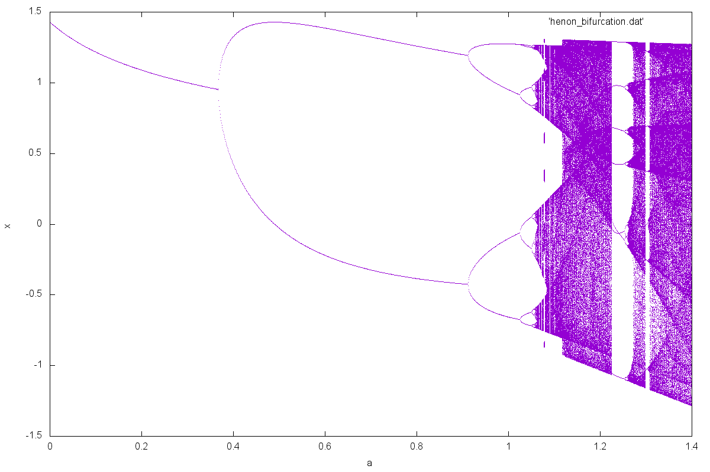
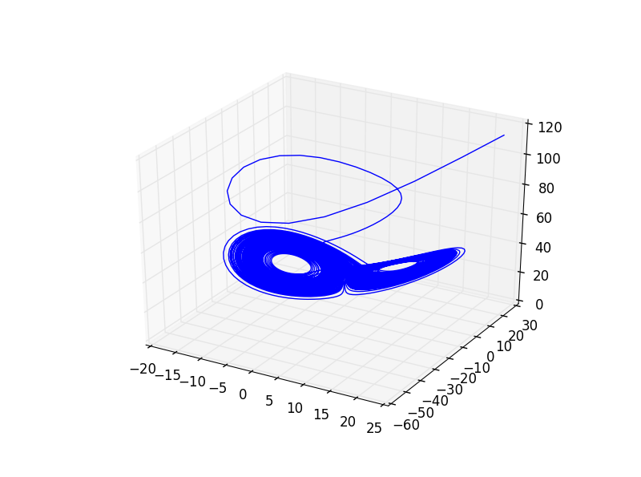

# nonlineardynamics
* Time evolution, bifurcation, etc for oscilllators described by nonlinear ODEs using Runge-Kutta order 4 (RK4) is used for time integration



*Bifurcation in Henon Map*

### Requirements
* Python with NumPy, SymPy and matplotlib

### Systems addressed
* Duffing Oscillator
* Lorenz Attractor
* Henon Map
* Logistic Map

### Generalised approach
Two files namely "general_interactive.py" and "general.py" have been developed for studying the time evolution of (mostly) any weakly nonlinear systems. The system will have to specified as an n-dimensional system of first order differential equations. In the first file, the user can run it and will be required to input the dynamical system on the go through a series of input prompts. This text is then processed in `sympy`. In the second file, the user can provide a file in a particular format and provide the file name as an argument while running through a terminal. The format of the file is as follows:

Line 1: System Name such as `duffing` or `lorenz_attractor`

Line 2: Dependent variables in the n-dimensional system `x y` or `x y z`

Line 3: List of parameters in the system `a b c`

Line 4: Values of the above parameters in that order for initiating the system `0.1 -2 10`

Line 5: RHS of the first of the n equations `y` or `-a*y - v*x - b*x**3 + f*sin(w*t)`

Line 6: RHS of the second equation as above

After the first four lines, there should be n lines for n equations.



*Lorenz Attractor*

### Example: Duffing Oscillator
The duffing equation (symbols for parameters have been changed for simplicity of input):


The two dimensional system would thus be defined as:


Input file `sysdef.txt` or `duffing`, as per user's liking, for this would then be:
```
duffing
x y
a b f v w
0.5 1 0.42 -1 1
y
-a*y - v*x - b*x**3 + f*sin(w*t)
```

The program can then be run from the terminal by running `python general.py sysdef.txt`

### To-Dos
* More systems to be addressed separately
* Add other important features such as bifurcation analysis, frequency responses, Poincare sections
* Time evolution animations
* Aesthetically pleasing visual outputs
* And more


*Self-similar structure in Henon Attractor*

